# Breeze Overlay — User Guide

A guide to building broadcast graphics in the Breeze editor and putting them on air.

No coding required. If you have used After Effects, Photoshop or any NLE, the model here will feel familiar: a stage, a stack of layers, a timeline with keyframes.

**Contents**

1. [How the pieces fit together](#1-how-the-pieces-fit-together)
2. [Starting up](#2-starting-up)
3. [The editor at a glance](#3-the-editor-at-a-glance)
4. [The app bar — projects, saving, undo](#4-the-app-bar--projects-saving-undo)
5. [The stage](#5-the-stage)
6. [The layers panel](#6-the-layers-panel)
7. [The properties panel](#7-the-properties-panel)
8. [The timeline](#8-the-timeline)
9. [Animating something — a worked example](#9-animating-something--a-worked-example)
10. [Easing](#10-easing)
11. [Text that changes on air](#11-text-that-changes-on-air)
12. [Data sources and tables](#12-data-sources-and-tables)
13. [Scenes — several graphics, one browser source](#13-scenes--several-graphics-one-browser-source)
13a. [Assets and video](#13a-assets-and-video)
14. [Getting it on air](#14-getting-it-on-air)
15. [Keyboard shortcuts](#15-keyboard-shortcuts)
16. [When something looks wrong](#16-when-something-looks-wrong)

---

## 1. How the pieces fit together

Breeze has three faces, all served by one small server on your machine.

| | What it is | Who uses it |
|---|---|---|
| **Editor** | Where you design and animate the graphic | You, before the show |
| **Browser source** | The `/play/…` URL you paste into OBS or vMix | The switcher |
| **Control panel** | PLAY / STOP and live text edits | The operator, during the show |

The important thing to know is that all three run the *same* renderer. What you see moving on the editor stage is exactly what goes to air — there is no separate "export" step and no second engine to surprise you.

A graphic has a shape to it that matches how live television works:

```
idle  →  playing-in  →  holding  →  playing-out  →  finished
```

PLAY rolls the graphic in and parks it at a **STOP marker**. It sits there — *holding* — for as long as the operator wants. STOP runs the outro. You will set those STOP markers yourself in the timeline.

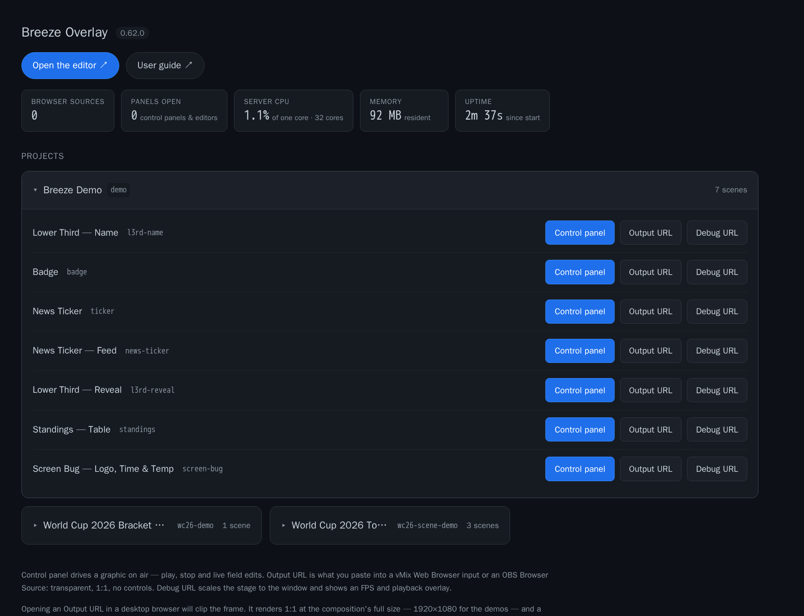

*The portal at `http://<host>:7331/` — the front door. Every project is a tile; opening one lists its scenes with links to the control panel, the browser-source URL and the debug view.*

---

## 2. Starting up

On the machine that will host the graphics, from a terminal:

```powershell
cd C:\projects\breeze_overlay
pnpm --filter @breeze/server start
```

Then open **`http://<host>:7331/`** — the portal. Everything the server hosts is reachable from there:

- **Open the editor** and **User guide** as buttons at the top. Both open in a new tab, so the portal stays where it is. The guide is this document, served from your own installation — no internet connection required.
- A **status strip** below them: how many browser sources and control panels are connected right now, what the server is doing for CPU and memory, and how long it has been up. It refreshes every couple of seconds while you are looking at it.
- A **tile per project**. Click one to open it and see its scenes.

You can also go straight to the editor at **`http://<host>:7331/editor/`** if you would rather skip the portal.

On first run the server installs three demo projects, so there is something to take apart before you build your own:

- **Breeze Demo** — a lower third, a badge, a news ticker and a standings table.
- **World Cup 2026 Bracket Demo** — a full tournament bracket driven from a data source.
- **World Cup 2026 Tournament Scene** — the same tournament as a scene: several graphics on one browser source, each triggering independently.

These are ordinary projects. They live in your data folder exactly as anything you create does, and you can rename, edit or **delete** any of them from the editor's project menu — see [Making and removing projects](#making-and-removing-projects). A deleted demo stays deleted, and will not come back the next time the server starts.

### Activity — a record of what changed

The **Activity** button on the portal opens a log of the things worth being able to look up afterwards:

| Recorded | Not recorded |
|---|---|
| Projects created and deleted | Browser sources connecting |
| Scenes created and deleted | Editor windows opening |
| Control panels connecting and disconnecting | PLAY / STOP and field edits |

The exclusions are deliberate. A browser source that flaps reconnects every few seconds and would bury the handful of entries a month you actually go looking for, and the status strip already answers "is it connected right now?". A refused scene delete is not recorded either — nothing changed.

**On "who".** Breeze has no accounts. An action is attributed to the address it came from and the browser it came from — `192.168.1.40 · Chrome on Windows` — not to a person. On a gallery LAN where machines are assigned that is usually enough to work out who; behind a proxy or a VPN it is not, and the page says so rather than implying otherwise. Hover the browser name to see the full User-Agent.

The log is written to `data/audit-<year>-<month>.jsonl` — one JSON object per line, one file per month, in the data folder next to your projects. It is plain text and greppable, nothing rotates or deletes it for you, and it is worth including in whatever backs up that folder.

### What the status strip is telling you

The two numbers worth knowing before a show:

**Browser sources** counts output pages that are actually connected — an OBS Browser Source, a vMix Web Browser input, a debug tab you left open. If this reads `0`, nothing is listening, and pressing PLAY on a control panel will do nothing visible. It turns green the moment something connects. Open a project tile and each scene shows its own count, so you can see *which* graphic the source is attached to.

**Panels open** counts control panels and editor windows. An editor registers itself against the scene it currently has open, so on a project tile you can see that someone is already working on a graphic before you open it yourself.

**Server CPU** is the Breeze process, expressed as a percentage of **one** core — not of the whole machine. On a multi-core box it can legitimately go above 100% while a video is transcoding. It is there to answer "is the server itself struggling?", which is a different question from "is this computer busy?"

### About addresses

`<host>` throughout this guide means **the machine running the Breeze server**.

- **Working on that same machine?** `<host>` is `localhost`, so the editor is at <http://localhost:7331/editor/>.
- **Working from anywhere else** — a laptop in the gallery, a switcher PC, a tablet — use that machine's name or IP address instead: `http://graphics-pc:7331/editor/`, `http://192.168.1.40:7331/editor/`.

The server listens on every network interface by default, so it is reachable from the rest of the LAN without any extra setup. **It prints the exact address to use when it starts** — take it from there rather than guessing.

This matters most for the browser-source URLs in [section 14](#14-getting-it-on-air). If OBS or vMix is on a different computer from the server, a `localhost` URL will point that machine at *itself*, find nothing, and show a blank source.

Two settings worth knowing, both environment variables:

| | |
|---|---|
| `BREEZE_PORT` | Defaults to `7331`. Change it if something else already has that port |
| `BREEZE_HOST` | Defaults to `0.0.0.0` (reachable from the LAN). Set it to `127.0.0.1` to keep the server private to its own machine |

---

## 3. The editor at a glance

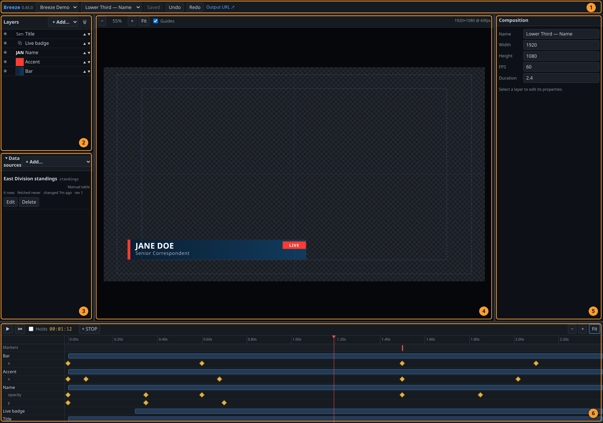

| | Region | What it is for |
|---|---|---|
| **1** | App bar | Pick the project and composition, save, undo, grab the output URL |
| **2** | Layers | The stack. Top of the list paints on top |
| **3** | Data sources | Live data feeding tables and tickers |
| **4** | Stage | The picture. Select, move, scale and rotate here |
| **5** | Properties | Everything about whatever is selected |
| **6** | Timeline | When things happen |

The three dividers between panels are draggable. **Double-click a divider** to reset that panel to its default width. Your layout is remembered between sessions.

---

## 4. The app bar — projects, saving, undo

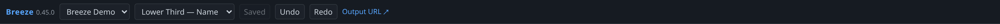

Left to right: the version number, the **project** picker, the **scene** picker, then **Save**, **Undo**, **Redo** and the **Output URL** link.

**Saving.** The button reads `Saved` when there is nothing to save and `Save` when there is. `Ctrl+S` does the same thing. A small red dot appears at the right-hand end of the bar whenever you have unsaved changes, and closing the tab with unsaved work prompts you first.

**Undo.** `Ctrl+Z` steps back, `Ctrl+Shift+Z` (or `Ctrl+Y`) steps forward. A whole drag counts as one step, not forty — dragging a layer across the stage and changing your mind is a single `Ctrl+Z`.

**Output URL** opens the browser-source page in a new tab. That is the URL you give to OBS or vMix.

If a change would produce an invalid composition, a red banner appears listing the problems and the save is refused. Fix the listed fields and save again.

### Making and removing projects

Both pickers carry a short list of actions below the things they list.

**+ New project…** at the bottom of the project picker. It asks for two things: a **name**, which is for you and can be anything, and a **URL key**, which is the part that ends up in web addresses. The key is suggested from the name as you type — "Riverside Hawks Basketball" offers `riverside-hawks` — and you can replace it with something shorter. Read [URL keys](#url-keys) below before you settle on one: it is set once and cannot be changed afterwards.

The new project opens straight away, empty, with one untitled scene ready to build.

**+ New scene…** at the bottom of the scene picker adds a scene to the project you are in. It asks the same two things, and the key follows the same rules — with one addition: it must not clash with anything the project already answers to, including the channel names of any [scene elements](#13-scenes--several-graphics-one-browser-source). The server appends its suffix, so a clash is avoided for you rather than reported.

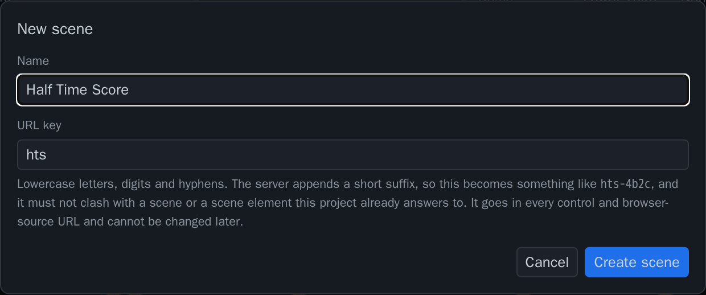

*The key is suggested from the name as you type, and stops following it the moment you edit it yourself.*

A new scene inherits the **stage size of the project it is added to**, not a fixed 1920×1080. Add a scene to a 1280×720 project and you get another 1280×720 scene.

**Delete scene…** at the bottom of the scene picker removes the scene you are looking at. There is one thing it will refuse to do: if another scene mounts this one as a layer — which is how [scenes](#13-scenes--several-graphics-one-browser-source) are assembled — the delete is blocked and the dialog lists every scene and layer still using it. Unlink those layers first, then delete.

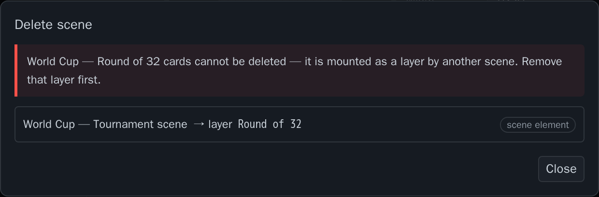

*Blocked, with the layer to go and remove named. There is no Delete button on this dialog at all — only Close.*

This is deliberate. Deleting a scene out from under something that mounts it does not break that parent loudly; it leaves it playing with one graphic silently missing, which is the kind of thing you find out about on air.

**Delete project…** at the bottom of the project picker. This one deletes the whole project directory — every scene, every uploaded asset, every data source — and there is no undo and no recycle bin. You have to type the project's name to confirm it. Anything already pointing at that project, a browser source in OBS or a button on a Stream Deck, stops working the moment it goes.

> Neither delete asks twice by accident. Choosing one from a picker only opens a dialog — nothing is removed until you confirm, so arrowing past `Delete project…` with the keyboard is harmless.

### URL keys

Every project and every composition has a short **URL key** as well as a name. The name is for you — "Random A Highschool — Basketball" is a perfectly good project name and it never appears in a web address. The key is the part that shows up in URLs:

```
http://<host>:7331/play/rahb-1k3f9/lt-4b2c
                        ↑           ↑
                        project     composition
```

When you create a project or a scene you can set the first part of that key. Type `rahb` and you get `rahb-1k3f9`; leave it alone and you get the default, `proj-1k3f9`. The characters after the hyphen are generated for you and cannot be edited — that is what guarantees no two projects ever collide, so you never have to hunt for a key that is still free.

The point of choosing it is telling things apart. Six games in a folder called `proj-1k3f9`, `proj-2m4x`, `proj-3p8k` are indistinguishable at a glance. `rahb-1k3f9` and `wchs-2m4x` are not.

Rules: up to 12 characters, letters, numbers and hyphens, and it is lowercased for you. Keys are **set once, at creation** — they cannot be renamed afterwards, because the key is baked into every browser source you have already pasted into OBS and every button on a Stream Deck. Pick it when you make the project; there is a copy button next to it thereafter.

---

## 5. The stage

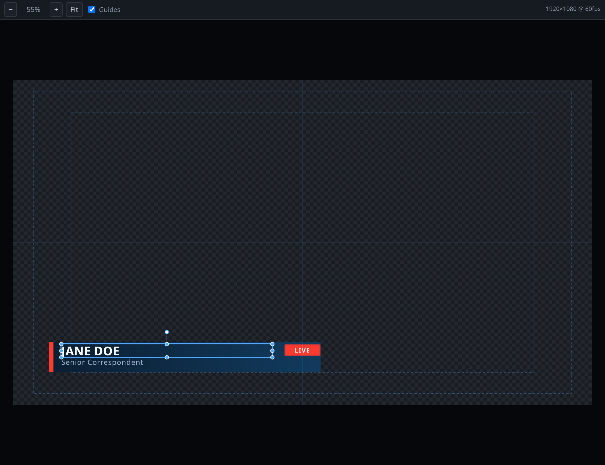

The checkerboard is transparency — the graphic goes over live video, so there is no background. A flat gray backdrop would make white text invisible, hence the checks.

**Toolbar:** zoom out `−`, the current zoom, zoom in `+`, **Fit**, and a **Guides** checkbox. On the right, the stage size and frame rate.

**Guides** draw the action-safe and title-safe boxes plus center crosshairs. Keep anything that must not be cropped inside the inner (title-safe) box.

They hide themselves automatically when the stage panel is narrower than 480px — at that size the dashed boxes cover more of the artwork than they frame. The checkbox grays out while that applies; widen the panel and the guides come back as you left them.

**Selecting and moving.** Click a layer to select it. Handles appear: drag inside the box to move, drag a corner or edge to scale, drag the stalk above the box to rotate. Locked layers show no handles.

**Getting around:**

- **Pan** — hold `Alt` and drag, or drag with the middle mouse button
- **Zoom** — `Ctrl` + mouse wheel, or pinch on a trackpad
- **Fit** — snaps the stage back to fill the viewport, and keeps tracking as you resize the window

If you select a layer and nothing appears on stage, look at the toolbar: it will tell you the layer *is not shown at this time* (the playhead is outside its lifetime) or *is off-stage at this time* (it has animated out of frame). Both are normal mid-animation — scrub the playhead to where the layer is on screen.

---

## 6. The layers panel

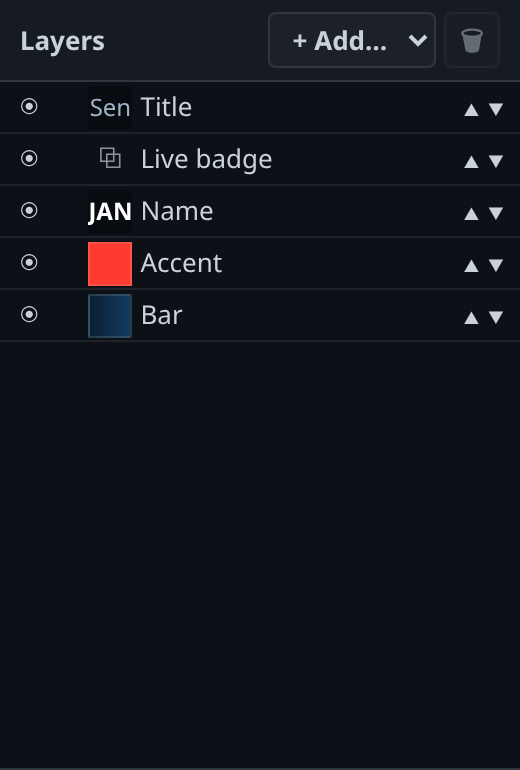

Layers are listed **top of stack first**, matching what you see: the layer at the top of the list paints over everything below it.

Each row has a visibility dot, a lock, a thumbnail of the layer's actual content, the name, and reorder arrows.

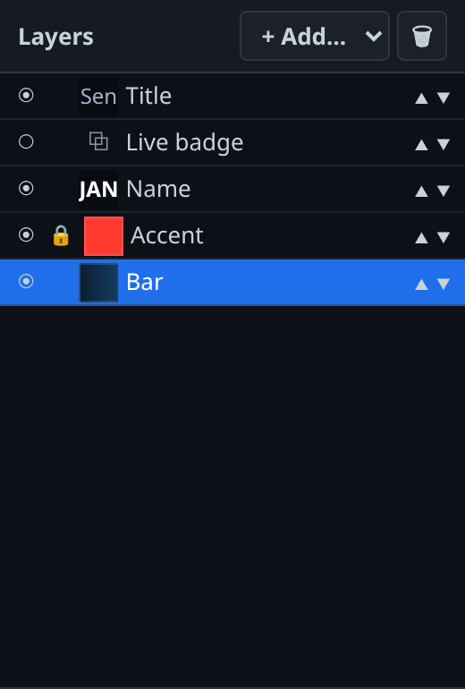

*Here "Live badge" is hidden (hollow dot), "Accent" is locked (padlock), and "Bar" is selected.*

| Action | How |
|---|---|
| Select | Click the row |
| Select several | `Shift`-click or `Ctrl`-click |
| Rename | Double-click the name, type, press `Enter` |
| Hide / show | Click the dot — `◉` visible, `○` hidden |
| Lock / unlock | Click the padlock. A locked layer cannot be dragged on stage |
| Move up / down the stack | The `▲` and `▼` arrows |
| Delete | The bin button, or press `Delete` with the layer selected |

**Adding a layer.** The `+ Add…` menu offers **Text**, **Shape**, **Image**, **Video**, **Crawl**, **Table** and **Group**.

> **Worth knowing:** a new layer starts at the playhead, as it would in After Effects. Add one with the playhead parked at 2 seconds and the layer does not exist before 2 seconds. If that is not what you wanted, drag its bar left in the timeline, or set **In** to `0` in the properties panel.

Hiding a layer only affects the editor's own preview; it does not remove the layer from the graphic. To keep something off air, give it a lifetime that never overlaps the on-air portion, or delete it.

---

## 7. The properties panel

Everything about the current selection. With **nothing** selected you get the composition itself — **Name**, **Width**, **Height**, **FPS** and **Duration**. That is where you change 1920×1080 to something else, or make the graphic longer.

Select a layer and the panel fills out. The sections you see depend on the layer type.

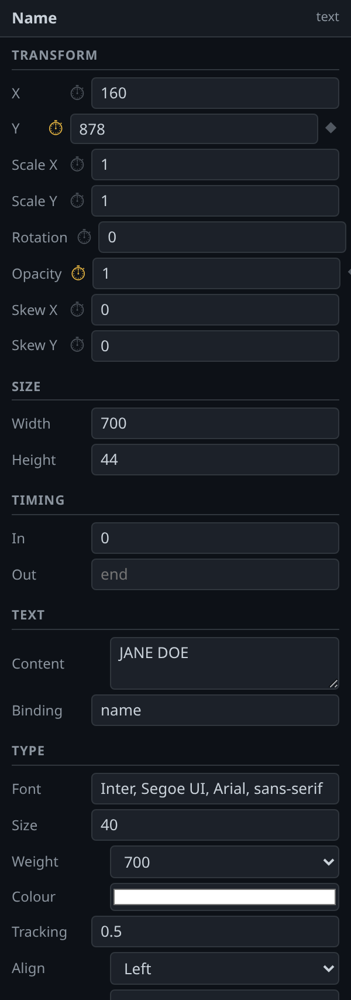

**Transform** — X, Y, Scale X/Y, Rotation, Opacity, Skew X/Y. These are the animatable properties; see [the timeline](#8-the-timeline) for the stopwatch buttons beside them.

**Size** — the layer's box in stage pixels.

**Timing** — **In** and **Out**, in seconds. **Out** left blank means "to the end of the composition". These are the same numbers as the layer's bar in the timeline; edit them here when you want an exact value.

**Effects** — Blur, Brightness and blend mode, on every layer type.

### By layer type

**Shape** — **Kind** (rectangle or ellipse), **Fill** and corner **Radius**.

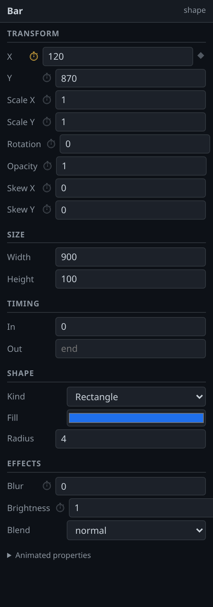

**Text** — **Content** is the text itself. **Binding** is covered in [section 11](#11-text-that-changes-on-air). **Fit width** condenses long text so it fits the box (see below). **Type** covers Font, Size, Weight, Color, Tracking, Align and Case. **Reveal** animates the text on piece by piece. Six presets: **Characters rise**, **Characters fade**, **Words rise**, **Words fade**, **Lines rise**, **Lines fade**. Each brings sensible **Stagger**, **Duration** and **Ease** defaults, scaled to the unit — the defaults show as grayed placeholder values, and typing over one overrides just that field.

**Crawl** (tickers) — **Speed** in pixels per second, **Direction**, a **Separator** printed between items, and the **Items** list, one per line.

**Image / Video** — Pick from **Asset** (the files uploaded to this project — see [section 13a](#13a-assets-and-video)) or type a **Path** directly, plus an optional binding. Video adds **Start at**, **Loop**, and **At end** — `Hold last frame` or `Clear`. Video is locked to the composition playhead, so it scrubs correctly in the editor and stays in sync on air.

A stinger usually wants **Clear**: a transition that has finished should leave nothing behind, and a held final frame stays parked over your program feed.

**Table** — see [section 12](#12-data-sources-and-tables).

### Fit width

Long names are the classic strap problem. Set **Fit width** to `Fit width`, give it a **Max width**, and text that would overflow is condensed horizontally to fit — but never squashed below **Min scale** (0.5 by default), because a name compressed to a third of its width is worse than one that runs long.

If a piece of text does hit that floor, the properties panel says so — *"Still wider than the box at min scale"* — which is how you find out that a strap is too short for its content *before* it is on air rather than after.

---

## 8. The timeline

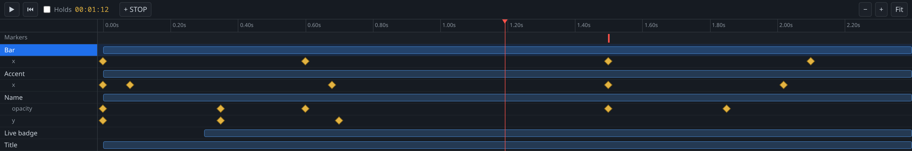

Reading the panel: names down the left, a time ruler across the top, a **Markers** lane, then for each layer a **lifetime bar** and — underneath it — one lane per animated property, with a diamond for each keyframe. The red vertical line is the playhead.

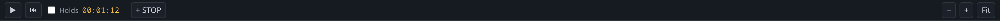

| Control | What it does |
|---|---|
| `▶` / `⏸` | Play or pause the preview |
| `⏮` | Jump to the start |
| **Holds** | When on, the preview pauses at STOP markers exactly as it will on air. Off (the default), it runs end to end — which is what you want while you are still designing the motion |
| Timecode | The playhead position |
| **+ STOP** | Add a STOP marker at the playhead |
| `−` `+` **Fit** | Zoom out, zoom in, fit the whole composition |

**Fit** shows everything at once: the full duration across the width, and every row down the page — it grows the timeline panel if it needs to, so you should not be left scrolling in either direction. On a composition with more rows than the panel is allowed to grow to, it gets as close as it can and keeps a vertical scrollbar; drag the divider above the timeline if you want more room than that.

**Moving the playhead** — drag anywhere on the ruler. `Space` plays and pauses, `Home` jumps to the start.

**Navigating** — `Ctrl` + wheel zooms around the pointer; `Shift` + wheel scrolls sideways.

**Lifetime bars** — the blue bar is when the layer exists. Drag the middle to slide it in time; drag either end to trim the in or out point. If a bar is too narrow to grab its edges, zoom in and the trim handles reappear.

**Keyframes** — the amber diamonds. Drag one to retime it. `Shift`-click to add to the selection. `Delete` removes selected keyframes; with no keyframes selected, `Delete` removes the selected layer instead. `Ctrl+C` and `Ctrl+V` copy and paste keyframes at the playhead.

**STOP markers** — the small red ticks in the Markers lane. Drag to move, **double-click to delete**. A STOP marker is where the graphic parks on air. Everything after the *last* one is the outro.

**Snapping.** Dragged keyframes and markers snap to other keyframes, to markers, to the playhead and to the start and end of the composition. Failing all of those they snap to whole frames.

---

## 9. Animating something — a worked example

Say you want a strap to slide in from the left.

1. **Park the playhead at 0.** Press `Home`.
2. **Select the layer** you want to animate.
3. **Position it where it should start** — off the left edge, so a negative X.
4. **Click the stopwatch `⏱`** next to X in the properties panel. It turns amber and drops a keyframe at the playhead holding the current value.

   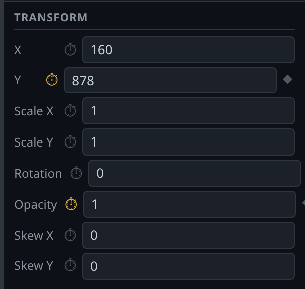

5. **Move the playhead** to where the move should finish — say 0.6s.
6. **Set X to its final value**, by typing it or by dragging the layer on stage. A second keyframe appears automatically.
7. **Press `Space`** to watch it.

That is the whole loop: turn on the stopwatch, move the playhead, change the value.

**Adding a keyframe without changing anything.** Once a property is animated, a small `◆` appears at the end of its row. Click it to drop a keyframe at the playhead holding whatever the value is right now — useful for making a value *hold* before it moves again. The diamond is filled in when there is already a keyframe at the playhead.

**Turning animation off.** Click the lit stopwatch again. That removes *every* keyframe on that property, so the value becomes static.

**Then set your hold.** Move the playhead to where the graphic should be fully built and press **+ STOP**. Animate the exit after it. Turn the **Holds** toggle on and press `▶` to rehearse it the way the operator will drive it.

---

## 10. Easing

Easing is what makes motion look designed rather than mechanical. **Double-click any keyframe** to open the easing editor.

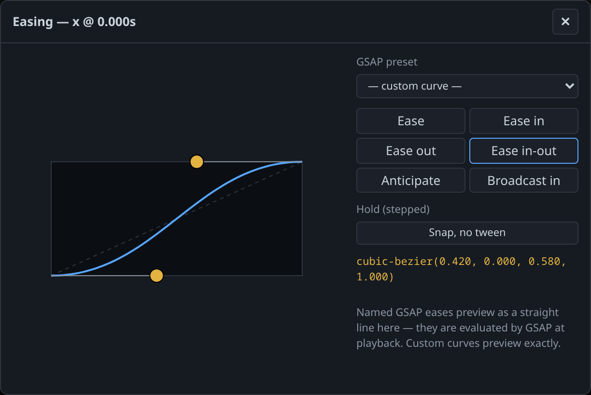

- **GSAP preset** — the named eases (`power3.out`, `back.inOut`, and so on). These are the workhorses.
- **The six preset buttons** — Ease, Ease in, Ease out, Ease in-out, Anticipate, Broadcast in. Each drops a custom curve you can then adjust.
- **The graph** — drag the two amber handles to shape the curve. The dashed line is linear, for reference. The `cubic-bezier(…)` readout below updates as you drag.
- **Snap, no tween** — no interpolation at all. The value jumps at the keyframe. Use it for hard cuts and blinking elements.

One thing to know about the preview: named GSAP eases draw as a straight line in this graph, because GSAP evaluates them at playback. Custom curves preview exactly. If you want to *see* the shape, use a custom curve; if you want a standard broadcast feel, the named presets are quicker.

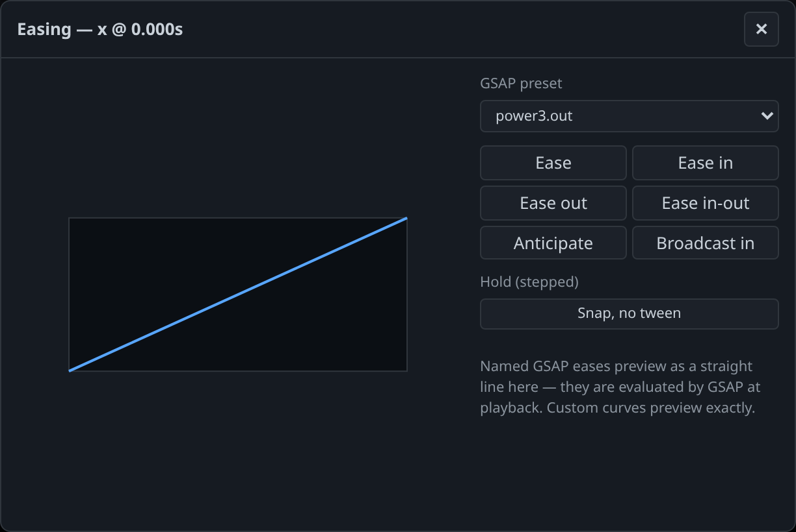

---

## 11. Text that changes on air

Any text layer with a **Binding** becomes a field the operator can edit live from the control panel — without touching the editor and without re-playing the graphic.

Give the layer a binding name in the Text section — `name`, `title`, `score`, whatever is meaningful — and it appears in the control panel under **Dynamic fields**, labeled with that name.

Bindings can also be filled straight from the URL, which is handy for testing and for automation:

```
http://<host>:7331/play/demo/l3rd-name?name=Jane%20Doe&title=Reporter
```

Crawl layers and table layers can carry bindings too, so an operator can replace a whole headline list or a whole table live.

---

## 12. Data sources and tables

Data sources sit under the layers panel, in the same column — the project's inputs directly above the layers that consume them.

Click the **▾ Data sources** heading to fold the panel away. Collapsed, it becomes a thin bar on the bottom edge and hands the whole column to the layer list; click again to bring it back at the size it was.

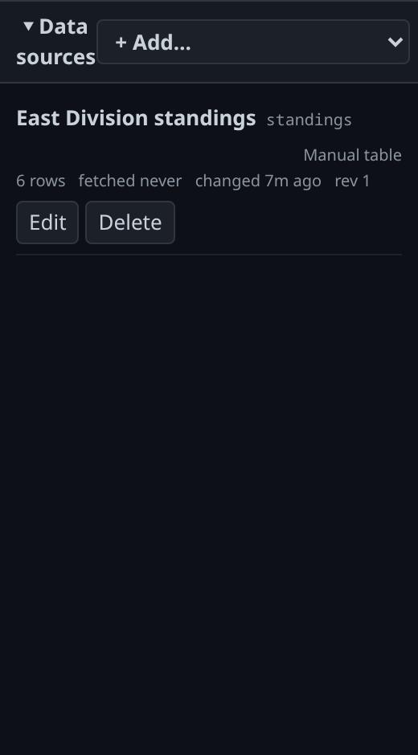

`+ Add…` offers eight kinds:

- **Manual table** — you type the rows. Good for standings, credits, anything you maintain by hand.
- **HTTP CSV / Google Sheet** — a URL that returns CSV. A published Google Sheet works directly: use its **Publish to web → CSV** link. No API key.
- **HTTP JSON** — a URL that returns JSON, with an optional path to the array inside it (for example `data.standings[0].teams`).
- **RSS / Atom feed** — a news or results feed URL. You get the same columns whichever flavour of feed it is: `title`, `link`, `date`, `description`, `author`, `category`, `image`, `guid`. Point a ticker at `title` and you have a headline crawl.
- **XML** — any other XML. Give it the **row element** — the tag that repeats, written as a path like `results/game`. Press **find it** and the panel fetches the URL and offers the repeating elements it found, with how many of each; click one rather than typing it. Child tags become columns, and so do attributes: `<score home="4" away="2"/>` gives you `score_home` and `score_away`.
- **Google Sheet — private (API v4)** — for a sheet you cannot publish. Paste the sheet's URL (or just its id) and a range like `Standings!A1:F30`. This one needs a credential set up on the server; see below.
- **Weather** — pick a provider and a place. See [Weather](#weather) — read it before you put weather on air commercially.
- **FTP / SFTP file drop** — watch a folder on another machine and use the newest file in it. See [File drops](#file-drops-ftp--sftp).

Each source shows how many rows it holds, how often it refreshes, when it last fetched and when the data last *changed*. Sources that are failing are highlighted with the error.

A source that stops answering keeps its last good rows. A feed going down does not blank a graphic that is on air — it shows an error here instead, which is the point of this panel.

### Weather

A weather source asks for a **provider** and a **place** rather than a web address. Type a latitude and longitude, choose °F or °C, and pick what you want back:

- **Current conditions** — one row. This is what a weather bug wants.
- **Hourly forecast** / **Daily forecast** — several rows, for a forecast strip or a table.

There are five providers, and the difference between them is mostly legal rather than technical:

| Provider | Where it covers | Can you use it commercially? |
|---|---|---|
| **NWS — api.weather.gov** | United States and territories only | Yes, freely. US government data |
| **MET Norway — Locationforecast** | Worldwide; sharpest in the Nordics and Arctic | Yes, with a credit on screen |
| **Bright Sky — DWD** | Germany and immediate surroundings only | Yes, with a credit on screen |
| **Open-Meteo — hosted** | Worldwide | **No.** Non-commercial use only |
| **Open-Meteo — self-hosted** | Worldwide | Yes |

> **Read this before going to air commercially.** Open-Meteo's hosted service is free for non-commercial use *only*. If your channel or site carries advertising or subscriptions, that counts as commercial use and you may not use it. The editor shows a warning on that provider for exactly this reason. Outside the United States you have three commercial options: **MET Norway** anywhere, **Bright Sky** in Germany, or your own Open-Meteo instance (choose **Open-Meteo — self-hosted** and give it the address, for example `http://localhost:8282`).

**Most providers require a credit on screen** — MET Norway, Bright Sky and both Open-Meteo options all do. You do not have to remember the wording: every weather source has an **`attribution`** column holding the right line for its provider, so bind a small text layer to it and the credit travels with the graphic wherever it goes.

**MET Norway wants to know who you are.** Like NWS, it blocks traffic it cannot identify, and it will try to contact you before blocking — but only if there is a contact to reach. Fill in **Contact for User-Agent**, or better, have whoever runs the server set `BREEZE_CONTACT` once for everything.

Whichever provider you pick, **you get the same columns** — `temp`, `tempMin`, `tempMax`, `feelsLike`, `condition`, `icon`, `precipProb`, `precipAmount`, `windSpeed`, `windGust`, `windDir`, `humidity`, `pressure`, `uvIndex`, `isDay`, `time`, `attribution`. That is deliberate: if you switch provider later, the graphic keeps working. Anything a provider does not report comes back blank rather than breaking.

`icon` is not a picture. It is a plain keyword — `clear`, `partly-cloudy`, `rain`, `thunderstorm`, `snow`, `fog` and so on — so you can map it onto your own artwork once and reuse that mapping everywhere.

Weather refreshes more slowly than other sources, and the minimum depends on the provider: 15 minutes for hosted Open-Meteo, MET Norway and Bright Sky, 5 minutes for NWS, 1 minute for your own instance. If you type something faster it is quietly raised to the minimum. This costs you nothing — none of these forecasts recalculate more than once an hour.

Two things vary by provider and are worth knowing before you build against one:

- **Not every provider fills every column.** MET Norway has no chance-of-rain or gust outside the Nordics, and Bright Sky's hourly forecast has no humidity. Those cells come back blank rather than breaking the graphic — but if a number matters to your design, check it is actually arriving before the show rather than during it.
- **Bright Sky's current conditions are a real observation** from the nearest weather station, not a forecast for right now. That is the more accurate answer and occasionally the more surprising one: it is what the station measured, which can differ from what a model says it should be.

If your own Open-Meteo instance is on `localhost` or elsewhere on your own network, the server refuses to reach it until someone allows that address; ask whoever set up the server to add `BREEZE_DATA_ALLOW_HOSTS=localhost` to its settings.

**Model** and **Time zone** are the two fields you can usually leave alone on the hosted service, and usually should not on your own instance.

- **Model** — blank means "let Open-Meteo choose". That is right against their hosted service, and often wrong against your own: your instance only holds the forecast models you have actually downloaded, and "let it choose" may ask for one you do not have. If you know which model your instance has, name it here — `ncep_gfs_seamless`, for example.

  To find a model's id, use [Open-Meteo's own API docs](https://open-meteo.com/en/docs): pick a model there and read the id off the `&models=` part of the URL it generates. That is the same value this field takes. **Copy only the model and the time zone** — everything else in that URL (the location, the units, the variables) is built for you here, and pasting a whole URL in will not work. The panel links to the same page next to the field.
- **Time zone** — blank means `auto`, which uses the time zone of the place you are forecasting. That is normally what you want: the times on screen are the times where the weather is. Set it explicitly (`MST`, `America/Phoenix`, `Europe/London`) if the graphic should read in your own clock instead.

If your instance has some of the data but not all of it, the source quietly asks again for a smaller set rather than showing nothing — you may see UV index come back blank while everything else works. That is the fallback doing its job, not a fault.

**Contact** identifies you to the weather service. Fill it in as `mystation.com, ops@mystation.com` — a website, an email, or both.

This matters most on **NWS**, which requires it. Their documentation is explicit about why: a more distinctive string is less likely to be caught up in someone else's security event, and if they can contact you they will do that before blocking you. Left blank, Breeze sends a generic string that *every* Breeze installation shares — so your traffic gets judged alongside everyone else's, and if somebody else's server misbehaves, yours can be blocked with no warning and no way for anyone to reach you.

Normally you set this **once for the whole server** rather than per source — whoever runs the Breeze server adds `BREEZE_CONTACT` to its settings and every source inherits it. The field here is for the unusual case of one server working on behalf of several stations. Anything you type here wins over the server setting.

### File drops (FTP / SFTP)

For the very common arrangement where somebody else's machine writes a file into a folder every few minutes — a scorer's laptop dropping `results-2026-08-03.csv`, a league office publishing standings overnight.

Fill in:

- **Protocol** — **SFTP** if you have a choice; it is encrypted and it is what most servers offer. **FTPS** is encrypted FTP. Plain **FTP** sends your password and your file readable by anyone on the network — fine for a public anonymous drop, not for anything with a login.
- **Host**, and **Port** if it is not the standard one.
- **Directory** — the folder to watch, for example `/results`.
- **Filename pattern** — which files count. `results-*.csv` means "anything starting `results-` and ending `.csv`". `*` stands for any run of characters, `?` for exactly one. If several files match, the **newest one wins**.
- **Format** — how to read the file once it arrives: CSV, JSON, XML or RSS. Set this yourself rather than trusting the file extension; a file named `.txt` that actually holds CSV is common.
- **Username** — leave blank for anonymous access.

If the drop needs a password or an SSH key, whoever runs the server stores it and gives you a name for it; you type that name into **Credential id**. As with Google Sheets, the password itself never goes into your project file.

A file dropped this way is read by exactly the same code that reads the equivalent web address, so moving a feed from a website to a drop folder — or the other way — does not mean rebuilding your graphic.

Drop boxes usually live on your own network, and the server will refuse to connect to one until its address is allowed. If you get an error mentioning `BREEZE_DATA_ALLOW_HOSTS`, that is what it means — pass the host name to whoever runs the server.

### Which Google Sheets option?

Use **HTTP CSV** if you can. Publishing a sheet to the web needs no credential, no Google Cloud project, and nothing to rotate later. Use **Google Sheet — private** only when the sheet genuinely cannot be public.

If you do need it, someone with access to the server sets up the credential — either an API key (for a sheet shared as "anyone with the link") or a service-account JSON key (for a fully private sheet, which must then be shared with the service account's `client_email`, exactly as you would share it with a person). You put the *name* they gave it into **Credential id**. The credential itself never enters your project file, which is what makes a project safe to copy between machines or hand to someone else.

### Poll intervals

The minimum is 5 seconds for most sources, and higher for weather (see above). Match it to how fast the data actually changes: a live scoreboard feed wants 5–10 seconds, a standings sheet 30, a news feed several minutes, weather every 15. Polling faster than the data changes costs nothing on screen — a graphic only re-renders when the content actually differs — but it is traffic to somebody else's server, and some of them will start refusing you.

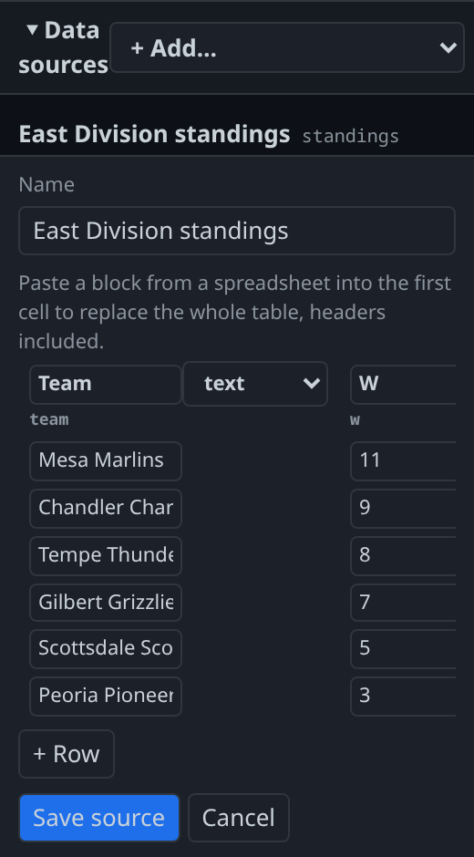

*The manual editor is a small spreadsheet. You can paste a block straight out of Excel or Sheets into the first cell — headers included — and it replaces the whole table.*

### Table layers

Add a **Table** layer, then point its **Source** at a data source.

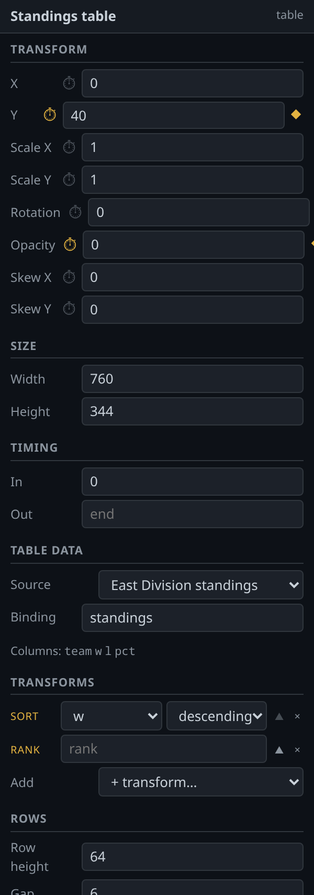

**Transforms** reshape the data on its way to screen, in order, top to bottom:

| Transform | Use |
|---|---|
| **Sort** | Order by a column, ascending or descending |
| **Filter** | Keep only rows matching a condition |
| **Rank** | Write a position number into a column |
| **Limit** | Keep the first N rows |
| **Offset** | Skip the first N rows |
| **Advance bracket** | Fill a knockout bracket's later rounds from its earlier ones |

**Rows** controls **Row height**, the **Gap** between rows, and **Rows per page**. Leave rows-per-page at `0` and the table shows every row that fits the layer box. Set it to, say, 5 and the graphic pages through the data — the operator's **NEXT** button steps to the next page while the graphic holds on air.

**Row reveal** animates rows on individually, with the same Preset / Stagger / Duration controls as text reveals. **Re-sort** is how long rows take to slide into a new order when the underlying data changes — set it to `0` for a hard snap.

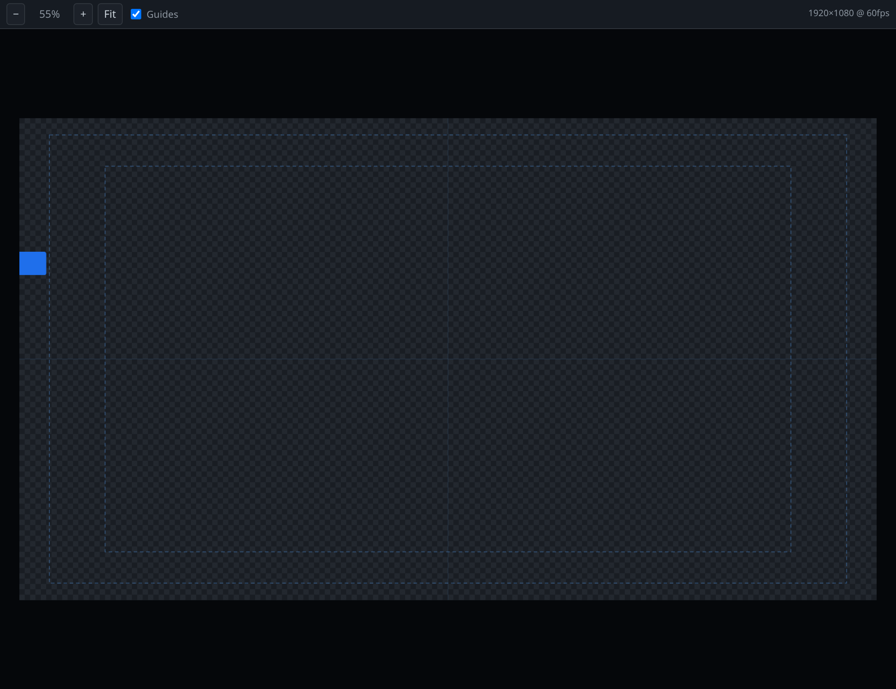

**Animating inside a row.** A row is built from a template — the cells you design once and the table repeats per row — and those cells can carry their own keyframes. A rank number that counts up, a form arrow that flicks in, a background chip that wipes across behind the name: all of that animates per cell, and every row plays it.

Cell animation runs on its **row's** clock, not the table's. If your rows reveal with a stagger, each row's cells move as that row arrives rather than all at once — otherwise the last row's animation would play while that row is still waiting off-screen. A table with no row reveal has nothing to stagger against, so every row moves together.

> **This is not editable in the editor yet.** Cells are not selectable in the layers panel, so cell keyframes have to be written into the project file by hand for now. The graphics play them correctly; there is just no UI to author them with. If you want this, say so — it is the next piece of table work.

### Brackets

A knockout bracket is a table like any other — one row per match, two team lines per row — drawn as one table layer per round column, with the row pitch doubling each round so a match sits centered between the two it came from.

Three examples ship, and they are meant to be read together:

| File | What it is |
|---|---|
| `examples/world-cup-bracket.json` | The whole 32-team tournament as one tree. **This is the limit case, not the recommendation** — read the next section before copying it. |
| `examples/world-cup-scene.json` | The same tournament done properly: a round-of-32 card wall and a round-of-16-onward tree, as two elements of one scene. |
| `examples/world-cup-2026-bracket.csv` | The data behind all of them. |

#### How many teams fit on one screen

Fewer than you would like, and this is the single most useful thing to know before you design a bracket.

Do the arithmetic before you draw anything. A 32-team tree needs nine columns across the frame — sixteen first-round matches split into two halves of eight, then four tiers of winners and the final. On a 1920-wide stage with sensible margins that is about **200px per column**, and a column has to hold a team, a score and some breathing room. What comes out the other end is **17px type**.

Seventeen pixels on a 1080-line frame is **1.6% of picture height**. For comparison, [general video legibility guidance](https://legibility.info/rules-for-text-in-videos) puts the floor for body text at 1080 somewhere around **40–60px**, and [TV interface guidelines](https://medium.com/you-i-tv/designing-for-10ft-ceeb202c1315) rarely go below 24pt. The 32-team tree is roughly a third of the recommended minimum. It also forces three-letter codes rather than names, because 200px does not hold "SWITZERLAND".

It gets worse downstream, in ways that are easy to forget:

- **Downscaling.** A 1080 graphic in a 720 stream loses a third — 17px becomes 11px.
- **Compression.** Small light text on a dark background is exactly what a bitrate-starved encoder smears first.
- **The second screen.** More people will see your bracket on a phone in a bar than on a calibrated monitor.

So the 32-team tree is not broken and it is not useless — it is a **video wall graphic**, or something a viewer pauses and studies. It is the wrong thing to cut to for six seconds during a half-time show.

**What to do instead: split the tournament.** `examples/world-cup-scene.json` shows the pattern.

| Graphic | Shows | Type size | % of picture height |
|---|---|---|---|
| Full 32-team tree | 31 matches, 9 columns | 17px, 3-letter codes | 1.6% |
| Round-of-32 cards | 16 matches, 4×4 grid | 40px, full names | 3.7% |
| Round-of-16 tree | 15 matches, 7 columns | 30–34px, codes | 2.8–3.1% |

Halving the tree is what pays for the tree. Drop the round of 32 and you go from nine columns to seven *and* from 31 matches to 15, so every remaining column gets wider and taller at once. The round of 32 then gets a layout that suits it — sixteen cards, four across, four down — where each tie has a whole card instead of a 200px sliver and the team names are readable at a glance.

Two useful side effects. Cards have room to say what actually happened: the tree squeezes a shoot-out into the score as `1 (3)`, while a card writes `PENALTIES · MAR WIN 3-2` across the top. And the split is free operationally, because both graphics live in one [scene](#13-scenes--several-graphics-one-browser-source) on one browser source — two buttons on the control panel, not two sources to wire up in OBS.

The general rule, whatever the sport: **decide your minimum readable type size first, work out how many columns that allows, and then decide how much of the tournament fits.** Not the other way round. A bracket that technically fits is not the same as a bracket anyone can read.

#### Building one

`examples/world-cup-bracket.json` is a complete 32-team bracket; open it and take it apart.

What makes a bracket different from standings is that most of it is *derived*. The **Advance bracket** transform fills it in: you type the first round's teams once and a winner per match as the tournament goes, and every round after that fills itself.

Your data needs a row per match with at least:

| Column | What it holds |
|---|---|
| `slot` | A unique id for the match — `QF1`, `R32L-4`, anything |
| `round` | Which round it belongs to. Rounds run in the order they first appear |
| `homeTeam` / `awayTeam` | The two teams. Fill these in the first round only |
| `winner` | `home`, `away`, or the winning team's name |

With those column names, **Advance bracket** needs no configuration at all: it sends the winner of position 1 and position 2 of a round into position 1 of the next, and so on down the tree.

Two things you can add:

- **Routes.** A `feeds` column holding `"QF1:home"` overrides where a winner goes, for anything the plain tree cannot describe — a bracket split into left and right halves, a reseeding rule, a play-off. Leave a row blank to use the tree; `feedsLoser` does the same for the beaten side, which is how a third-place play-off gets filled.
- **Scores.** Tick *Decide from scores* and the transform works out the winner from your score columns when the `winner` column is empty, with optional shoot-out columns to break a draw.

**Carry** lists what moves with a team. The default is just the name; set it to `Team, Code` and a team's three-letter code travels with it, so your round-of-16 graphic does not need a second lookup.

Two rules worth knowing:

- **Put it first.** Advance reads every round, so anything above it that drops rows — a Filter, a Limit — leaves it nothing to work from. The editor warns you if it ends up in the wrong place. In the bracket example each of the ten tables runs Advance first and filters to its own round afterwards.
- **An undecided match advances nobody.** A drawn score with no shoot-out, a blank winner, a winner naming a team that is in neither line — all of them leave the next slot empty rather than guessing. That is deliberate: an empty slot on air is recoverable, the wrong nation in a semi-final is not.

On a manual table, tick **Resolve bracket** above the grid and the rounds after the first fill in as you type. Those cells go read-only while it is on — they belong to the transform, and letting you type into them would only look like it worked.

### Tickers fed from a source

A crawl layer can take its headlines from a data source instead of a typed list — which is what an RSS feed is for. Under **Crawl data**, pick a **Source** and then the **Column** to read. For a feed that is almost always `title`.

The typed **Items** above stay where they are, and they still matter: they are what shows before the first fetch lands, and what stays up if the feed later comes back empty. Write something neutral there rather than leaving demo text in it.

The stage shows the real rows while you author — the same data the graphic will use on air — so you can confirm a ticker is actually bound to its feed without putting it up. It refreshes on the source's poll interval while the data panel is open.

New headlines join the rotation at the loop seam — they scroll in the way a ticker is supposed to update, never appearing in place. That means a change can take up to one full rotation to show, which is correct, not a delay to work around.

The **Transforms** on a crawl work exactly as they do on a table. A newest-first ticker limited to five stories is a **Sort** on `date` descending followed by a **Limit** of 5.

### The separator

**Separator** is what prints between items, and again between the last and the first as the loop comes round. Pick one from the list — bullet, diamond, em dash, pipe, arrow and the rest — or choose **Custom…** to type your own.

The spacing either side of the glyph is part of the value, which is why the presets include it. If you go custom, pad it yourself: `•` with no spaces renders as `storyone•storytwo`.

---

## 13. Scenes — several graphics, one browser source

A lower third and a screen bug usually belong to the same show. They share a look, they were designed together, and they are often on air at the same time — but they roll at different moments, so neither one can be part of the other's timeline.

A **scene** is how you put both on one browser source while keeping them independently triggered.

### What a scene is

Nothing new to learn. A scene is an ordinary composition that contains other compositions as layers, each one marked **Independent** in the properties panel.

```
Game Scene            ← the scene, one browser source
├── Screen Bug        ← independent — rolls on its own
├── Lower Third       ← independent — rolls on its own
└── Background band   ← ordinary layer, part of the scene's own timeline
```

An ordinary composition layer is *absorbed* into the timeline it sits in — that is what you want for a reusable badge inside a lower third, where the badge should animate as part of the strap. Ticking **Independent** does the opposite: that element keeps its own timeline, its own PLAY, its own STOP, and its own place in the control panel. The scene simply hosts it.

### Building one

1. Build the lower third and the bug as normal compositions, and get them working on their own.
2. Make a new composition for the scene.
3. Add each one as a composition layer, and tick **Independent** on each.
4. Order them in the layers panel. Top of the list paints on top, exactly as with any other layer — that is what decides whether the bug sits over or under the strap when both are up.

Because an independent element brings its own timeline, the scene has nothing to say about *when* it moves. Keyframes and the In/Out lifetime bar are therefore switched off on an independent layer, and the save is refused if a file somehow has them. Position still works normally — drag it on the stage to nudge a full-frame element without going back and editing it.

Anything in the scene that is **not** independent — a shared background band, a common shadow — belongs to the scene's own timeline and plays with the scene itself.

### Triggering them

Each independent element gets its own address, and it is the element's own name, not the scene's:

```
http://<host>:7331/api/control/<project>/bug/play           the bug
http://<host>:7331/api/control/<project>/lower-third/play    the lower third
http://<host>:7331/api/control/<project>/game-scene/play     the scene's own layers
```

That name is the element's **Channel** — set it in the properties panel to whatever the operator should type. Leave it blank and the address falls back to the composition's URL key, which works but is longer (`bug-1a2b` rather than `bug`). Setting a channel is worth the ten seconds: it is what ends up written on a Stream Deck button and taped to a desk.

Nothing else about the way you already trigger graphics changes. One button per element, the same URL shape, the same names. The only difference is that the two elements now share a render surface instead of costing two.

The control panel shows the same thing: open the scene's control page and you get a block per element, each with its own PLAY / STOP / NEXT / CLEAR and its own state readout. Each block links through to that element's own panel for its text fields — every element is a composition, so it already has a full panel of its own.

Two elements can both have a field called `name` without interfering. They are separate graphics that happen to be neighbors.

There is also a **CLEAR ALL** on a scene panel, which takes every element down in one press. Reloading the browser source does the same thing, but far more bluntly and with a visible flash; use CLEAR ALL.

### Setting fields from the URL

On a single graphic you can seed text straight from the play URL — `?name=Jane`. On a scene there is more than one graphic, so say which one, with a dot:

```
/play/<project>/game-scene?bug.temp=72&lower-third.name=Jane
```

The part before the dot is the element's name. A parameter with no dot goes to the scene's own layers. If you misspell the element name the value is ignored and the browser console lists the names that would have worked.

One consequence: **field names cannot contain a dot** on a graphic used inside a scene, since the dot is what splits the two halves.

### Using the same graphic twice

A scene can hold two copies of the same composition — a HOME badge and an AWAY badge from one design. Give each one a **Channel** in the properties panel (`badge-home`, `badge-away`) and they trigger separately at those addresses. Without it they share a name, and every trigger fires both.

### When to use one, and when not to

A scene is right when the elements belong to the same show and roll from the same operator position. It saves a render surface in vMix and halves the source list.

It is the wrong tool when the elements need to be shown and hidden independently *in the switcher*, or transitioned separately by OBS or vMix. Once they share a browser source, the switcher sees one thing. If an element needs its own fade in the switcher, give it its own source.

---

## 13a. Assets and video

### The asset bin

**Assets** is the third panel down the left column, folded by default. Open it, then drag files onto it or use **Upload**. Images, videos and fonts uploaded here belong to the project, so every composition in it can use them, and they travel with the project folder when you move it to another machine.

Uploaded files get a new name — `logo-3f9a2c11.png` rather than `logo.png`. That is deliberate: the suffix is a fingerprint of the file's contents. Upload a corrected version and it gets a *different* name, so browser sources pick it up immediately instead of showing the old one until someone clears a cache inside vMix. Upload the identical file twice and you get one entry, not two.

Each row has a **⧉** button that copies the asset's path, for pasting into a field or a binding default. **🗑** deletes, with a confirmation — a file marked *in use* is referenced by the composition currently open, but a file with no such mark may still be used by another composition in the project, so read the name before confirming.

### Uploading a corrected file

Upload something whose name is already in the bin — a re-exported `logo.png`, say — and the editor asks what you meant before it sends anything:

- **Replace.** Every layer using the old file switches to the new one, in *every* composition in the project, including ones you do not have open. When it finishes, the bin tells you how many layers changed and names the compositions, so you can go and look. The old file is **retired**, not deleted: it stays on disk and stays in the bin under the `retired` state, so if you replaced the wrong thing you can still get it back. Filing carries over — the new file keeps the old one's title, folder, tags, source, license and expiry.
- **Upload as new.** Both files stay in the bin and nothing on air changes. Existing layers keep pointing at the file they already have.

Drop a whole folder of corrected files and you get **one** dialog for the batch, not one per file. Pick Replace or Upload as new for all of them, and override the odd one that differs on its own row.

Each row shows the old size and the new one — if they match, it says **same size**, which usually means you have re-dropped the file that was already there. Breeze cannot tell for certain without uploading it first, so it asks anyway; either answer is safe in that case, because identical files are recognized as identical once they arrive and nothing is changed or retired.

### Video and transparency

**A `.mov` or `.mp4` cannot carry transparency in a browser source.** This catches people out badly, because the graphic looks correct in the editor — over the editor's own dark background — and goes to air as a black rectangle over your program feed.

The format that works is **WebM with an alpha channel**. If your designer delivers a ProRes 4444 `.mov` stinger, upload it and press **⇄** on its row in the asset bin. The server converts it, showing progress as it goes, and adds the `.webm` to the bin when it finishes. Then point your video layer at the new file.

A large stinger takes minutes. You can keep working while it runs; **✕** cancels.

### If the ⇄ button is grayed out

Transcoding needs **ffmpeg**, which Breeze does not ship. Hover the button and it will tell you exactly what is missing.

Install it, make sure `ffmpeg` and `ffprobe` are on your `PATH`, and **restart Breeze** — the check runs at startup. On Windows the simplest route is `winget install ffmpeg`; on Debian or Ubuntu, `apt install ffmpeg`.

If ffmpeg lives somewhere unusual, set `BREEZE_FFMPEG_PATH` and `BREEZE_FFPROBE_PATH` to the full paths.

One ffmpeg build in circulation lacks the `libvpx-vp9` encoder. Breeze refuses to use it rather than producing a file with the transparency quietly flattened — the button stays disabled and says so. Install a full build.

Only one transcode runs at a time. That is intentional: this server may also be feeding graphics to your switcher, and a video encode will take every core you give it. If the machine is not on air, `BREEZE_TRANSCODE_CONCURRENCY` raises the limit.

---

## 14. Getting it on air

### Adding the browser source

The URL you need looks like this:

```
http://<host>:7331/play/<project>/<composition>
```

Click **Output URL ↗** in the app bar and copy the address, or open the project's tile on the portal and take it from the **Output URL** button there.

**OBS** — Sources → **+** → Browser. Paste the URL, set width `1920`, height `1080`. No custom CSS needed; the page is transparent already.

**vMix** — Add Input → Web Browser. Same URL, size 1920×1080.

> **Check the host part before you paste.** The Output URL link inherits whatever address you opened the editor with. Open the editor at `localhost` and you will copy a `localhost` URL — which works only if OBS or vMix is running on the same machine as the server. On any other machine that URL points the switcher at itself and the source comes up blank. Swap in the server's name or IP address, the one it printed at startup. See [About addresses](#about-addresses).

> **A graphic never appears just because you added the source.** The output page shows nothing until something tells it to play. Adding a browser source in OBS, or opening the URL to check it, will not put a graphic to air. That is deliberate — it is the control panel's job. If you *want* the source appearing in the switcher to be the cue, add `?autoplay=1` to the URL.

### The control panel

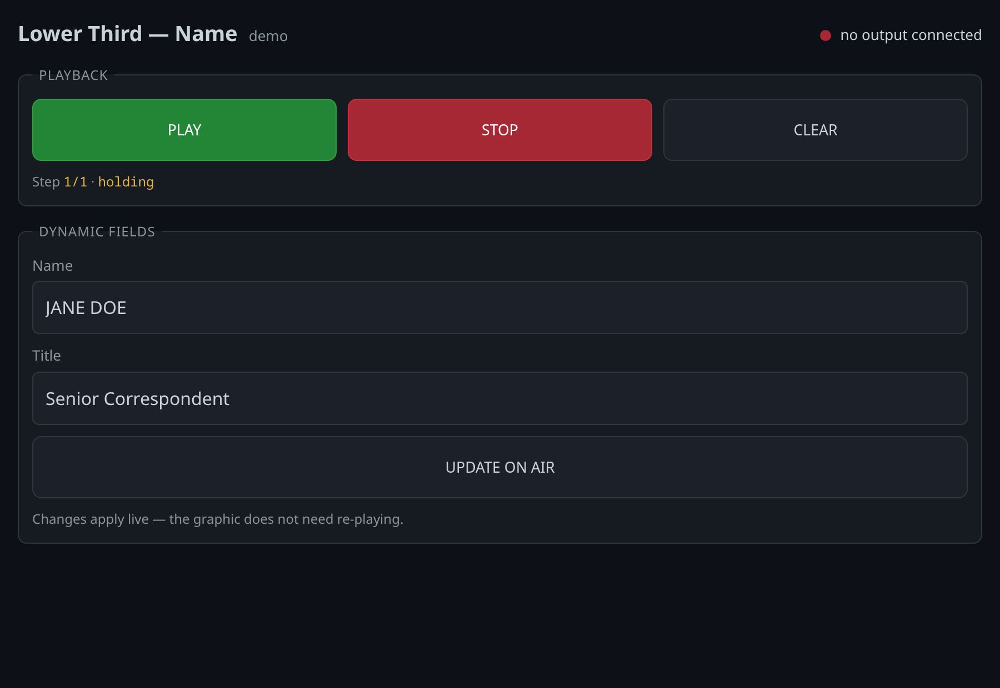

One page per composition, designed to be usable at speed on a laptop or a tablet in the gallery.

- **PLAY** — rolls the graphic in and holds it at the next STOP marker. Press it again and it advances to the next hold, then eventually runs the outro. Repeated PLAY steps the graphic all the way through, which is the one-button workflow. **PLAY can never take a graphic off air.**
- **NEXT** — advances to the next hold. Only shown when the graphic has more than one.
- **STOP** — runs the outro. This is how a graphic leaves air.
- **CLEAR** — hard reset. Nothing on screen, immediately. The panic button.
- **Step 1/1 · holding** — which hold the graphic is on and what it is doing right now.
- **Dynamic fields** — edit the text and press **UPDATE ON AIR**. Changes apply live; the graphic does not need re-playing.

The indicator at the top right says whether an output page is actually connected. If it says *no output connected*, the browser source is not open — pressing PLAY will do nothing visible.

### Checking a graphic without going to air

Open the **Debug URL** — the third button on each scene in the portal's project tile, or add `?scale=contain&debug=1` to the play URL yourself. That scales the stage to the window and adds a readout of the state, time, step and frame rate.

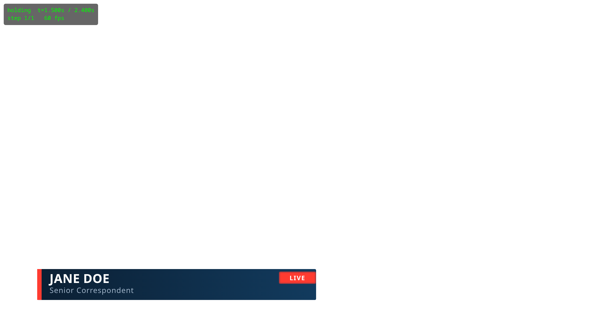

In a debug tab: `Space` play, `→` next, `Esc` stop, `Backspace` clear.

The three buttons on every scene do different jobs, and it is worth being clear which is which:

| Button | What it opens | Use it for |
|---|---|---|
| **Control panel** | The operator page | Driving the graphic — PLAY, STOP, live text edits |
| **Output URL** | The transparent 1:1 page | Pasting into OBS or vMix. Nothing else |
| **Debug URL** | The same page, scaled to fit, with a readout | Checking a graphic in an ordinary browser tab |

Opening an **Output URL** in a desktop browser will look wrong, and is not. See [When something looks wrong](#16-when-something-looks-wrong).

---

## 15. Keyboard shortcuts

**Everywhere in the editor**

| | |
|---|---|
| `Ctrl+S` | Save |
| `Ctrl+Z` | Undo |
| `Ctrl+Shift+Z` / `Ctrl+Y` | Redo |

**When not typing in a field**

| | |
|---|---|
| `Space` | Play / pause the preview |
| `Home` | Playhead to the start |
| `Delete` / `Backspace` | Delete selected keyframes — or the selected layer, if no keyframes are selected |
| `Ctrl+C` / `Ctrl+V` | Copy keyframes / paste them at the playhead |

**Stage**

| | |
|---|---|
| `Alt`-drag or middle-drag | Pan |
| `Ctrl`+wheel | Zoom about the pointer |

**Timeline**

| | |
|---|---|
| `Ctrl`+wheel | Zoom about the pointer |
| `Shift`+wheel | Scroll sideways |
| Double-click a keyframe | Edit its easing |
| Double-click a marker | Delete it |

**Layers**

| | |
|---|---|
| `Shift`-click / `Ctrl`-click | Add to the selection |
| Double-click a name | Rename |

**Debug / output tab**

| | |
|---|---|
| `Space` | Play |
| `→` | Next |
| `Esc` | Stop |
| `Backspace` | Clear |

---

## 16. When something looks wrong

**The graphic does not appear in OBS.** The output page waits to be told to play. Open the control panel and press PLAY, or add `?autoplay=1` to the URL. If pressing PLAY does nothing at all, check **Browser sources** on the portal's status strip — a reading of `0` means no output page is connected for anything to play *on*, which is usually a wrong host in the URL rather than a problem with the graphic.

**A scene will not delete — it says something else is using it.** Another scene mounts it as a layer. The dialog lists which ones and which layer in each; open those and remove the layer, then delete. Breeze refuses this on purpose: the parent would go on loading and playing with one graphic silently missing, and you would find out during a show rather than now.

**I deleted a project by mistake.** There is no undo and no recycle bin — the project directory, its assets and its data sources are removed from disk. That is why the confirmation makes you type the name. If you have a release snapshot or a backup of your data folder, restoring the project's directory into `data/projects/` and restarting the server brings it back.

**A layer has vanished from the stage.** Check the stage toolbar — it will say whether the layer is outside its lifetime at this playhead, or has animated off-stage. Also check the visibility dot in the layers panel.

**A layer cannot be dragged.** It is locked. Click the padlock.

**A newly added layer is stuck at the end of the timeline.** It was created at the playhead. Drag its lifetime bar left, or set **In** to `0`.

**Save is refused with a red banner.** The composition is invalid. The banner lists each problem with the field it belongs to; fix those and save again. Nothing is lost in the meantime — your work is still in the editor.

**The motion looks stuttery in OBS but fine in the editor.** A Browser Source ticks at the OBS output frame rate unless *Use custom frame rate* is enabled in its properties. If the debug overlay reports 30 fps, check OBS → Settings → Video → FPS. The page cannot paint faster than OBS ticks it.

**A name is running past the end of its strap.** Turn on **Fit width** for that text layer and set a **Max width**. If it is already on, the text has hit the **Min scale** floor — the strap genuinely is too short for that name.

**The graphic looks cropped when I open the play URL in a browser.** It is not. The output page is 1:1 at full stage size — a 1920×1080 graphic in a smaller desktop window will clip. Use the **Debug URL** on the portal instead, or add `?scale=contain` to see it fitted to the window. A graphic low in the frame, like a ticker at y=1000, is the confusing case: it plays correctly and is simply below the bottom of the window, so PLAY looks as though it did nothing.

**In a scene, triggering one element rolls both of them.** They are sharing a name. This happens when the same composition is used twice in one scene — two copies of a badge, say. Give each one its own **Channel** in the properties panel and trigger those names instead. See [section 13](#13-scenes--several-graphics-one-browser-source).

**A scene element will not take keyframes.** That is deliberate. An independent element brings its own timeline, so the scene has no say in when it moves — animate it in its own composition instead. Position on the stage still works.

**A field set from a scene's URL is being ignored.** Check the part before the dot matches the element's name exactly — `?bug.temp=72`, not `?screenbug.temp=72`. The browser console lists the names that would have worked. A parameter with no dot at all goes to the scene's own layers, not to any element.

**One element of a scene is missing and the rest are fine.** That element failed to build; the page deliberately keeps the others running rather than going black. The browser console names the element and the reason. Open that composition on its own play URL to see the error in isolation.

**I need to rename a project or composition's URL key.** You cannot, by design — the key is already inside every browser source pasted into OBS and every trigger button on the Stream Deck, and changing it would break all of them silently. The *name* can be changed freely at any time; only the key is fixed. If the key is genuinely wrong, create a new project or composition with the right one and copy the work across.

**A table or ticker is showing old data.** Check the source's row in the data panel. "Fetched" is when it last tried; "changed" is when the content last actually differed. If fetched is recent and changed is not, the origin genuinely is not changing. If fetched is stale, look for the error under the source — a failing source is highlighted, and keeps its last good rows deliberately so the graphic does not blank.

**A source will not fetch and says it refuses a private address.** The server will not fetch URLs on your own network by default, because it sits on the same LAN as the switcher and would otherwise be a way to reach it. If the feed really is on the LAN — a scoring PC, an internal results server — someone with access to the server adds that host to `BREEZE_DATA_ALLOW_HOSTS`.

**A table's numbers are sorting in the wrong order — 10 before 9.** That column is being read as text. Check its type in the source: CSV, XML and Sheets all arrive as text and the type is guessed from a sample, so a column with a stray note in one cell ("9 *") gets read as text for every row. Fix the cell, or declare the column's type on the source.

**A ticker bound to a source is still showing its typed items.** Three things to check, in order: a **Column** is picked (a source with no column does nothing); the column name matches one the source actually has; and the column is not empty for every row. In all three cases the ticker deliberately falls back to the typed items rather than going blank.

**A ticker's headlines look stale on the stage.** The preview refreshes on the source's poll interval, but only while the data panel is open — it stops polling when you collapse it. Expand the panel, or press **Refresh** on the source.

**A private Google Sheet returns a permission error.** A service account is not you. The sheet has to be shared with the account's `client_email` address, the same way you would share it with a colleague.

**NWS started returning errors or 403s after working fine.** Almost certainly the User-Agent. Fill in **Contact** on the source, or better, have `BREEZE_CONTACT` set on the server. Without it you are sharing a generic string with every other Breeze installation, and NWS blocks by that string.

**A weather source says NWS has no forecast for that point.** `api.weather.gov` covers the United States and its territories only. For anywhere else, use MET Norway (worldwide, commercial use fine with a credit), Bright Sky if you are in Germany, or Open-Meteo — and check the commercial-use note above before choosing that last one.

**MET Norway returns "forbidden".** Two likely causes, neither of them a password. Most often it is the coordinates: MET rejects anything with more than four decimal places, and a latitude pasted out of Google Maps has six — Breeze trims them for you, so this points at a hand-edited source file. Otherwise it is identification: fill in **Contact for User-Agent**, or have `BREEZE_CONTACT` set on the server.

**Bright Sky says it has no station near that point.** It carries DWD data, which is Germany and a little way over the borders — nothing further afield. Use MET Norway for anywhere else.

**A weather source will not save, saying it needs a base URL.** You picked **Open-Meteo — self-hosted** but did not say where your instance is. Fill in the instance address, or switch to the hosted provider. It refuses rather than quietly using the hosted service, because that service is non-commercial and falling back to it silently could put you in breach without anyone knowing.

**I typed a 30-second weather poll and it says 900.** Weather providers set their own limits and the field raises anything below them. Nothing is wrong, and you lose nothing: forecasts do not recalculate more than hourly.

**My own Open-Meteo instance works in a browser but the source says the request was rejected.** Almost always the **Model** field. A URL you tested by hand probably had `&models=…` on it; leaving the field blank asks for "best match" instead, which may want a model your instance has not downloaded. Put the same model id into **Model**.

**My weather temperatures are wrong by about 30 degrees.** Check the **Units** setting — °F and °C, not the provider. If they are right and the numbers are still wrong, check the latitude and longitude have not been swapped; Phoenix is `33.4484, -112.074`, and the longitude is the negative one in the Americas.

**A file drop says no file matches the pattern.** The pattern is matched against the file *name* only, not the path, and it has to match the whole name. `results-*.csv` will not match `2026-results.csv`. Capitalisation does not matter. If you are unsure what is actually in the folder, the error tells you how many files it saw.

**A file drop is showing yesterday's results.** It takes the newest file that matches. If today's file was written with a different name — a typo, or a different date format — it will not match the pattern and yesterday's will still be the newest match. Widen the pattern, or fix the name.

**A file drop asks for a credential I do not have.** Leave **Credential id** blank for an anonymous drop. If the server needs a login, whoever runs the Breeze server stores the password or SSH key and gives you the *name* to type in — you never enter the password itself.
